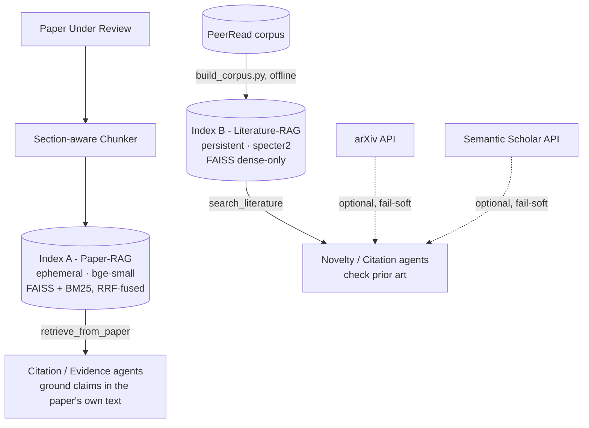

# RAG Implementation - Technical Deep Dive

*Covers `core/rag/` as it stands today. Written for a team presentation - every
claim below was verified against the actual code and, where noted, against
real test runs, not assumed from design intent.*

## Why two separate indexes, not one

The reviewer needs to answer two structurally different questions, and one
embedding model / one index can't serve both well:

| Question | "Does this paper argue for X consistently?" | "Has anyone published X before?" |
|---|---|---|
| Answered by | **Index A - Paper-RAG** | **Index B - Literature-RAG** |
| Scope | The one paper being reviewed | A large external corpus |
| Lifecycle | Ephemeral - built fresh per review, discarded after | Persistent - built once offline, loaded at startup, reused across every review |
| Granularity | Chunk-level (many vectors per paper) | Paper-level (one vector per paper) |
| Retrieval | Hybrid dense + sparse (BM25), fused | Dense only |
| Embedding model | `bge-small-en-v1.5` (general-purpose, short-passage) | `specter2_base` (trained specifically so scientifically-similar papers sit near each other) |

Forcing both into one index would mean picking one embedding model and one
lifecycle for two jobs that need different answers to both questions - a
general-purpose embedder is not tuned for "is paper A prior art for paper B,"
and rebuilding a persistent corpus index on every single review request would
be wasteful and slow.

## Index A - Paper-RAG (the paper's own text)

**Purpose:** ground an agent's claim in the actual submitted paper - e.g. "what
evaluation metrics does the Method section report?" - with retrieval that
catches both semantic matches *and* exact terms (a specific metric name, a
hyperparameter value) that pure embedding search tends to blur over.

### Chunking (`core/rag/chunking/section_chunker.py`)

A two-pass, structure-first design - split on the paper's own section
boundaries *before* splitting by size, so a chunk's `section` label stays
meaningful (a naive fixed-window split would blend Method text into Results
text at arbitrary boundaries):

1. **Pass 1 - structural split.** Raw section headings are normalized to one
   of 7 canonical labels (`abstract`, `introduction`, `method`, `experiments`,
   `results`, `related_work`, `conclusion`; anything unmatched → `other`) via
   regex matching, then each section's text is split into table paragraphs
   (kept intact, never size-split) and prose paragraphs.
2. **Pass 2 - size-bounding.** Prose spans longer than 500 tokens are split
   into overlapping windows (target 400 tokens, 50-token overlap) using the
   real `bge-small-en-v1.5` tokenizer when available, falling back to
   whitespace counting if the tokenizer can't load - chunking never hard-fails
   over a missing tokenizer.

Output: a list of `Chunk` objects (`chunk_id`, `paper_id`, `section`,
`para_idx`, `text`, `has_table`, `token_count`).

### Retrieval (`core/rag/indexes/paper_index.py`)

- **Dense half:** `bge-small-en-v1.5` embeddings, L2-normalized, FAISS
  `IndexFlatIP` (inner product on normalized vectors = cosine similarity).
- **Sparse half:** BM25 (via `rank_bm25`) over the same chunks, tokenized
  identically on both the index and query side (a shared `_tokenize()` - if
  index-time and query-time tokenization ever diverged, sparse scores would
  become meaningless).
- **Fusion:** [Reciprocal Rank Fusion](https://plg.uwaterloo.ca/~gvcormac/cormacksigir09-rrf.pdf)
  (`core/rag/retrieval/fusion.py`) - merges the two rankings by **rank
  position**, not raw score, since dense cosine scores and BM25 scores live on
  incomparable scales. `rrf_score = Σ 1/(k + rank)` per ranking, `k=60`
  (the standard default from the original RRF paper). Deterministic tie-break
  on candidate id.
- **Section filtering:** an agent can restrict retrieval to one section (e.g.
  Methodology Agent asking only within `method`/`experiments`) - implemented
  by over-fetching both rankings 3× before filtering, so post-filter results
  still fill the requested `k`.

Rebuilt fresh for every review run (`PaperIndex.build(chunks)`), never
persisted to disk.

## Index B - Literature-RAG (the persistent corpus)

**Purpose:** answer "has this contribution been done before?" against a large,
static body of prior work - currently PeerRead, per the problem statement's
mandatory dataset.

### Corpus construction (`core/rag/ingestion/build_corpus.py`, offline script)

- Parses PeerRead's `reviews/*.json` per venue/split (title, abstract,
  `accepted` ground-truth label, id, conference) - **not** the `parsed_pdfs/`
  full-text format; Index B only needs title+abstract for prior-art matching.
- Embeds each record as `"{title}[SEP]{abstract}"` with `specter2_base`
  (literal `[SEP]` - the exact input format SPECTER2 was trained on).
- Writes a `FAISS IndexFlatIP` + a parallel `records.jsonl` (`CorpusRecord`
  per line, same row order as the FAISS index - the two files must stay in
  lockstep, since `LiteratureIndex.load()` zips them back together by position).

**Leakage guard, enforced twice:**
1. **Build-time** - the corpus is built from PeerRead's `train`+`dev` splits
   only; the `test` split's paper ids are collected into an exclusion set and
   filtered out before the index is ever written (`exclude_review_split()`).
2. **Runtime** - `search_literature(..., exclude_paper_id=...)` drops any hit
   matching the paper currently under review, in case it slipped through
   anyway. Defense in depth: a paper can never "find itself" as prior art.

This split discipline happens to line up exactly with the problem statement's
requirement to evaluate only on the fixed PeerRead test split without leaking
it into anything upstream.

### Retrieval (`core/rag/indexes/literature_index.py`)

Dense-only nearest-neighbor search over the persistent `specter2` index —
no BM25 half here, since the corpus doesn't need exact-term matching the way
a single paper's Method section does; scientific-similarity embedding is the
whole point of using SPECTER2.

### Embeddings - the offline-fallback detail worth knowing

`Specter2EmbeddingProvider` depends on the `adapters` + `transformers` stack.
If that dependency chain fails to load for any reason, it **silently falls
back to `BgeSmallEmbeddingProvider`** (logged as a warning, not a crash) —
literature-similarity quality degrades, but the corpus stays queryable rather
than the whole reviewer going down over one optional dependency.

## Optional live sources (`core/rag/live_sources/`)

`search_arxiv()` and `search_semantic_scholar()` - supplementary, **not** part
of the graded evaluation set per the problem statement (PeerRead is the fixed,
required corpus; these are retrieval-only extras). Both share one resilience
contract: never raise, always degrade to `[]` on timeout/network error/parse
failure, so a flaky external API can never stall or fail a review run. Fixed
5-second timeout on each.

## Query-shaping helpers (`core/rag/retrieval/query_helpers.py`)

Two optional techniques that sit *in front of* retrieval, not inside it —
pure text transforms, independently testable without a live index:

- **`decompose_query`** - splits a compound question into 2–4 focused
  sub-queries (an LLM call if one's injected, else a heuristic split on
  coordinating conjunctions). A single embedding of a compound question tends
  to retrieve mediocre matches for both halves rather than a good match for
  either.
- **`hyde_query`** (HyDE) - generates a short hypothetical "ideal abstract"
  and embeds *that* instead of the raw question, for Index B search. A
  fabricated abstract embeds closer to real abstracts than a short question
  does, improving literature-search recall.

Both degrade to a deterministic template/heuristic with `llm=None` - never a
hard dependency.

## The tool interface (`core/rag/retrieval/tools.py`)

Four functions - `retrieve_from_paper`, `search_literature`,
`search_semantic_scholar`, `search_arxiv` - designed as the one seam agents
should import against, so the retrieval implementation underneath can change
without touching agent code. All four return the same `RetrievalResult` shape
regardless of source.

## Testing

24 unit tests (`tests/unit/{test_fusion, test_literature_index,
test_live_sources, test_paper_index, test_query_helpers,
test_section_chunker}.py`) - all passing, exercised against real FAISS/BM25,
not mocked. Covers: RRF correctness and tie-breaking, chunk-boundary
preservation, table-paragraph integrity, long-section splitting with overlap,
the leakage guard, and live-source failure degradation.

## Honest status - what's real vs. what's still a gap

| Piece | Status |
|---|---|
| Index A (paper's own hybrid retrieval) | **Real, tested, live-queryable** via the dashboard's RAG stage |
| Index B (literature corpus) code | **Real, tested** |
| Index B (literature corpus) *data* | **Empty** - `build_corpus.py` has never been run against a real PeerRead clone; `search_literature` always returns `[]` today, which the system reports honestly rather than faking |
| `literature_rag_agent.py` | Calls `LiteratureIndex` **directly**, not through the `retrieval/tools.py` interface layer |
| Query helpers (decompose/HyDE) | Built and tested, **not called by any agent yet** |
| Live sources (arXiv/Semantic Scholar) | Built and tested, **not wired into any agent yet** |
| `retrieval/tools.py` | Built as the intended integration seam, **currently unused** - nothing imports it |

**Bottom line:** the retrieval engine is solid and fully tested in isolation.
The gap is entirely on the *data* and *wiring* side - build the real PeerRead
corpus, and decide whether query decomposition/HyDE/live sources get wired
into the agents that would benefit (Novelty, Citation) or stay dormant as
built-but-unused capability for now.
